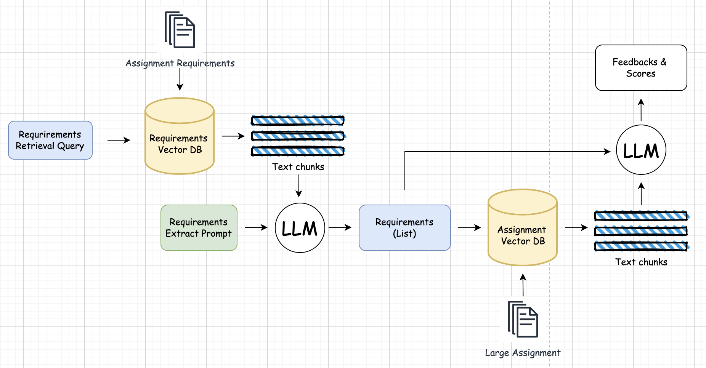
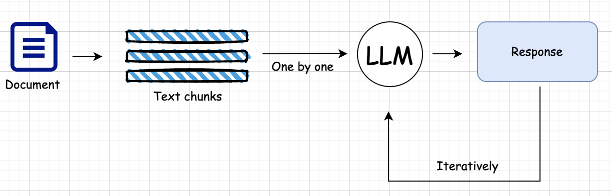
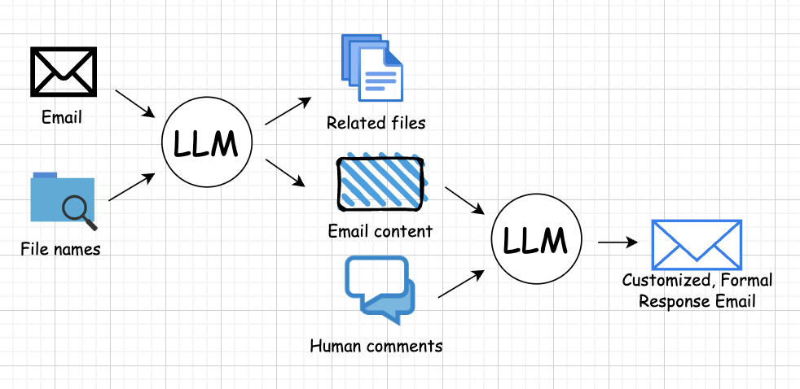

# AI Academic Feedback Assistant

Developed with [NVIDIA AI Workbench](https://www.nvidia.com/en-au/deep-learning-ai/solutions/data-science/workbench/), AI Academic Feedback Assistant empowers academic graders by automating repetitive and time-consuming tasks like document summarization, highlighting key points in lengthy papers, aligning document with grading criteria, providing formal feedback & response, and analyzing complaint emails to pinpoint specific issues. 

Users can focus on streamline their workflow, while NVIDIA AI Workbench automatically optimized their GPU power locally and privately with the help of NVIDIA AI Workbench. For more technical users, different models and customizable prompts are available for testing.

* [Background & Inspiration](#background-inspiration)
* [Testing Instruction](#testing-instruction)
* [Features](#features)
* [Requirements](#requirements)
* [Customize your workflow](#customize-your-workflow)

## Background & Inspiration

Recently, it took **five weeks** for my assignment to be graded, sparking a wave of complaint emails from fellow students. Instead of addressing each one individually, the graders posted a brief announcement to ease the tension. After some asking, I discovered that over **350 submissions** had been manually graded by just two graders, one of whom was part-time! Clearly, this wasn’t sustainable.

That's when inspiration struck. I came up with an idea to automate and accelerate the grading process. Over time, I expanded the concept, realizing its potential to be applied across multiple domains.

## Testing instruction

  Download the txt files in static folder.

  Most of the instructions are included in the video, please check it out [here](https://youtu.be/yNRyyJulyBU)

 - Step 1: Install and open NVIDIA AI Workbench
 - Step 2: Clone the github repository
 - Step 3: Wait for build (take some time)
 - Step 4: Enter your NVIDIA Catalog API Key as Secret
 - Step 5: Start the chat application!
 - Step 6: Follow the video for actions you can do!

## Features

  Checkout the [blogpost](BLOG.md) for technical details

### 1. Requirements - Assignments - Feedback RAG

### 2. Recursive summarization

### 3. Address complaint emails 

## Requirements

- Preferable GPU with compute capability > 7.0. [(More information)](https://developer.nvidia.com/cuda-gpus)
- Preferable allocating 16384MB Memory.
- Can be run with reasonable speed on MAC with 32GB Unified Memory.

## Customize your workflow

  - Try different models!
  - Try changing prompts!

## Blog post
Checkout the blog post [here](BLOG.md)
